# Exercise 2: Customizing IoT Central Application

## Overview

This exercise will cover how to add custom branding and operator resources to an Azure IoT Central application with white labeling options for a better visual fit with an organization’s other applications

### Task 1: Customize Azure IoT Central UI 

1. To create a custom theme, in the application page from the left-hand menu under **App setting** click on **Administration**.

    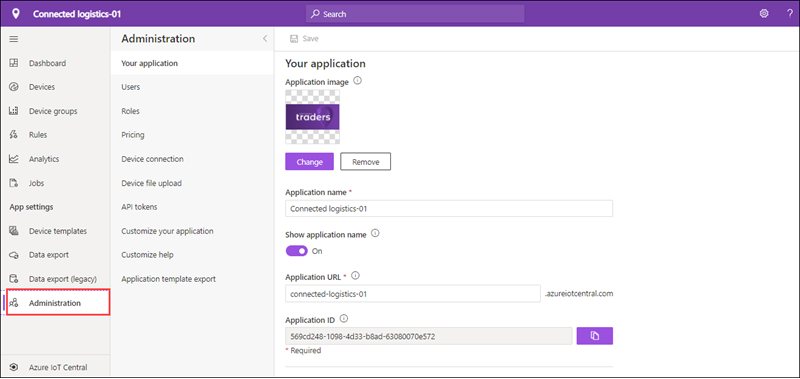

1. In the **App settings** page select **Your Application**. 

    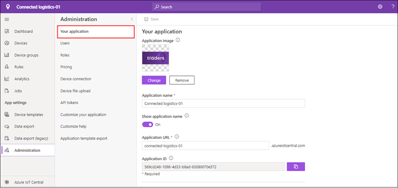

1. Under **Application Name** update the name of your application.

1. Under **Application URL** you can update the URL of your application. When you change your URL, the old URL will no longer work, and you need to notify your users about the new URL to use. For now, leave it as default.
 
    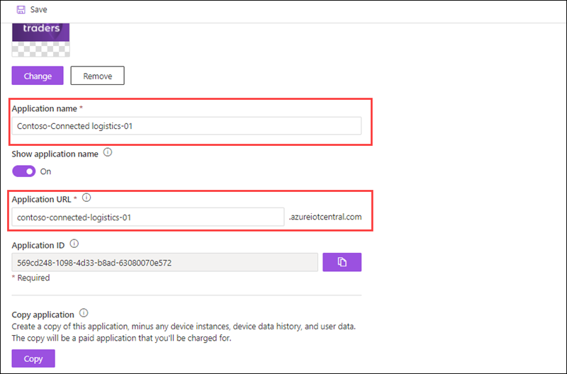
  
1. To customize your application image click on change under **Application image**, in the Open dialog box, browse to **C:\AllFiles\Labfiles\images** folder, and select app.png and click on **Open**. This image appears on the application tile in the **My Apps** page of the **IoT Central** application manager.

    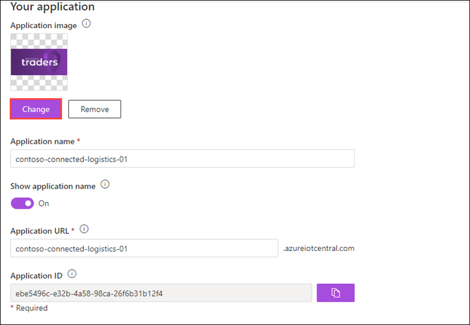

1. Select **Save**.

1. To verify changes in your application from the left navigation menu click on the **Azure IoT central** icon. 

   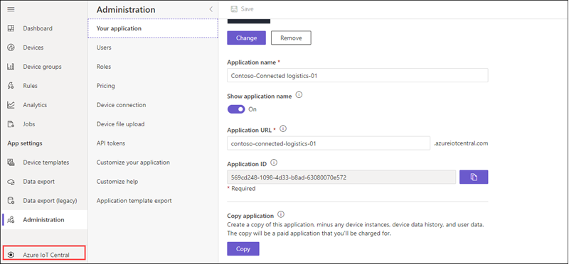

1. In **Azure IoT central** page from the left navigation menu select **My apps** here you can see the application tile displays the updated application image.

   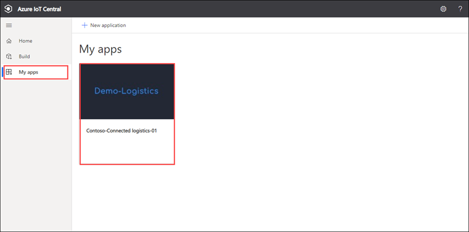

1. On the **My apps** page click on your application. 

1. In the application page from the left-hand menu click on **Administration**.

1. To create a custom theme for your application, in the **Administration** section select **Customize your application**.

      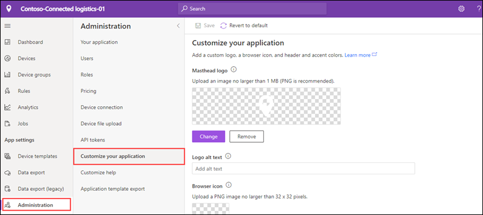

1. In **Customize your application** page under **Masthead logo** click on **Change**, in the Open dialog box, browse to C:\AllFiles\Labfiles\images folder, and select logo.png and click on **Open**.

      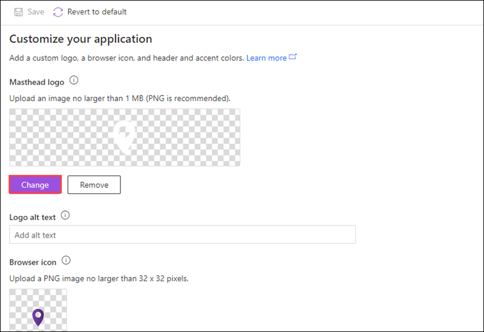

1. Now to change the browser icon click on **Change** under **Browser icon** option. In the Open dialog box, browse to C:\AllFiles\Labfiles\images folder and select browsericon.png, and click on **Open**. 

1. Under **Browser colors**, you can change the color of the page header and the color used for accenting buttons and other highlights. 

1. Enter **#6a5acd** in **Header**, **Accent** under **Browser colors**. For more information about HEX Value color notation, see HTML Colors[https://www.w3schools.com/html/html_colors.asp].

    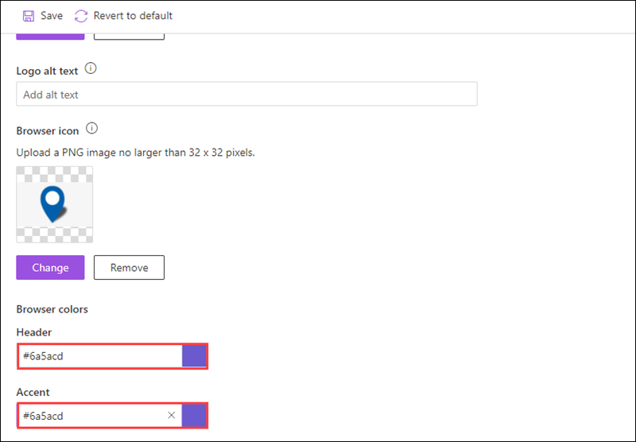

1. Click on **Save**.

1. You can observe the changes replicated in the application.

   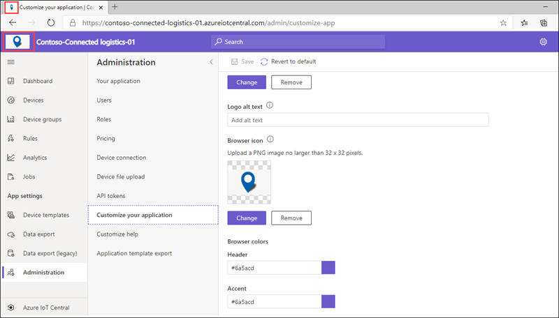

1. To provide custom help information to your operators and other users, you can modify the links on the application **Help** menu.

1. On the **Administration** page click on **Customize help**.

   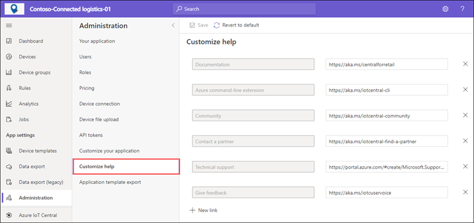

1. From here you can add new entries to the help menu and remove default entries if needed.

1. In the **Customize help** page click on **+ New link**,  under **Link name** enter a name for your link and under **URL** provide the link. When done click on **Save**.

   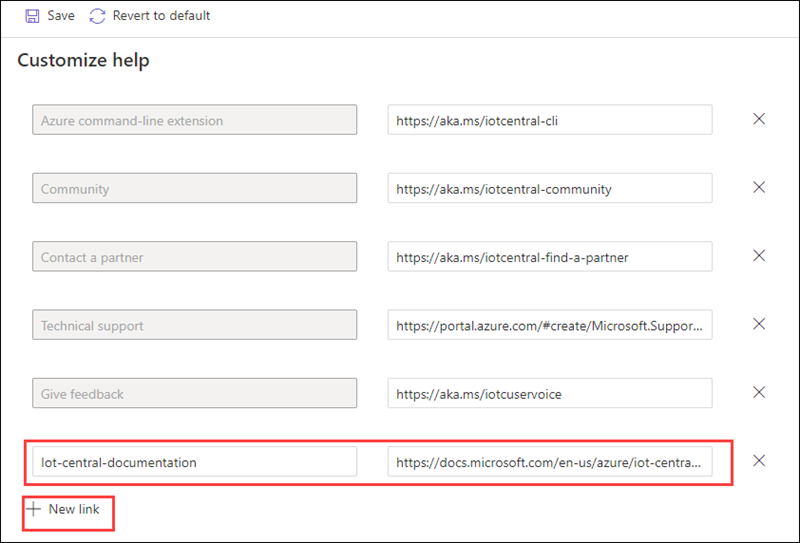

