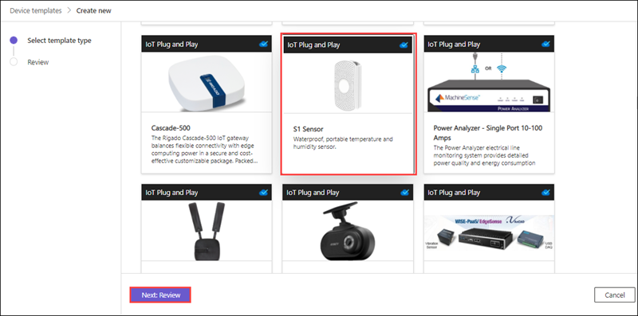
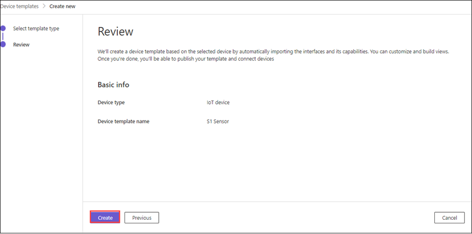
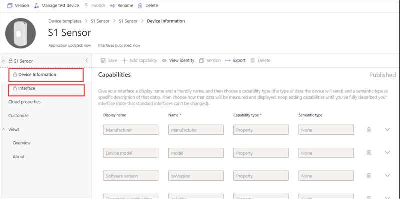
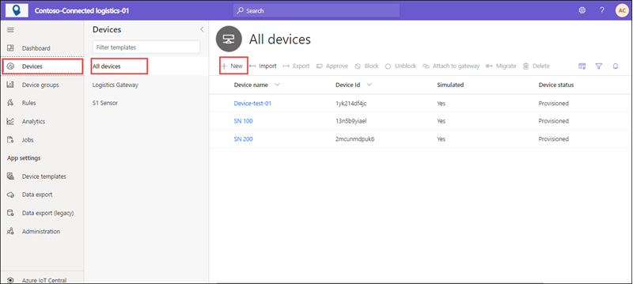
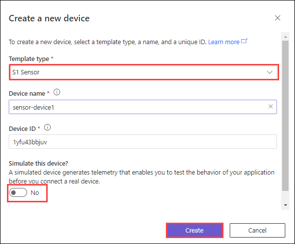
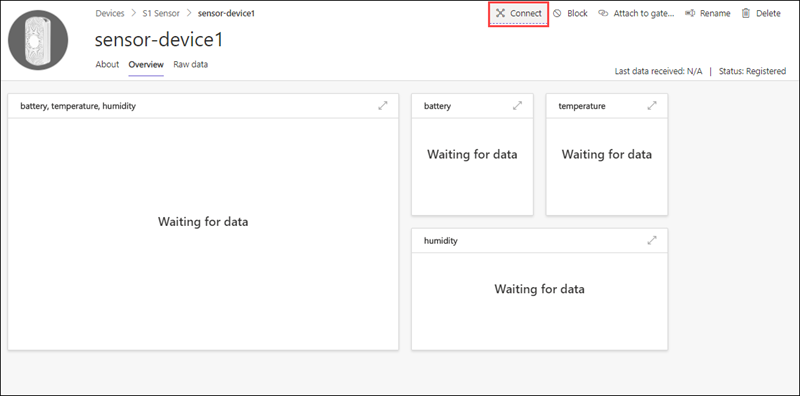
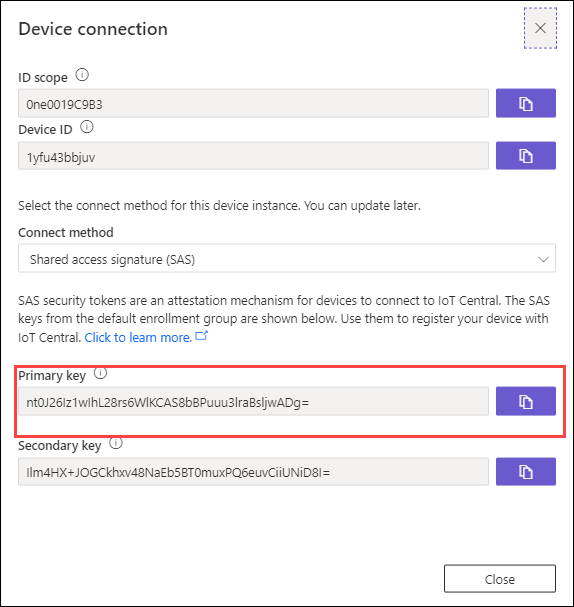
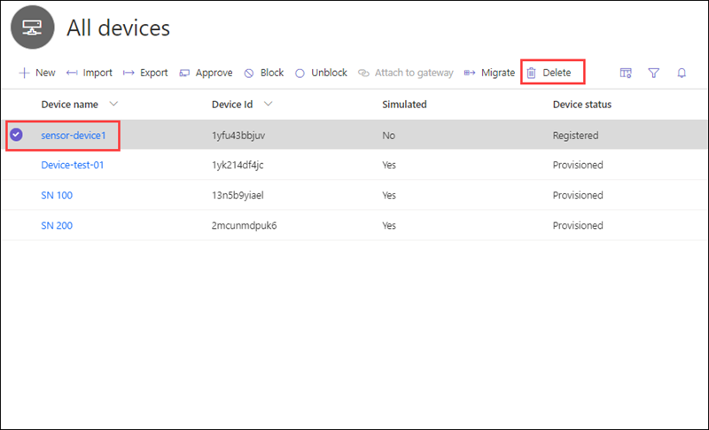
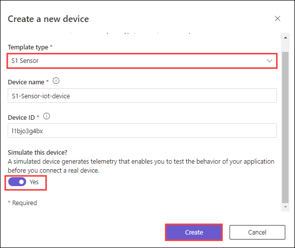
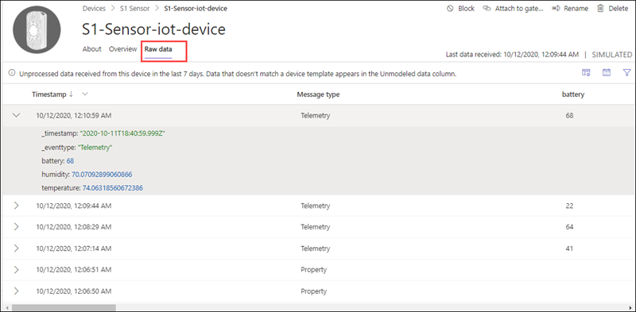

# Exercise 3: Connect IoT Plug and Play Certified Devices

## Overview

In this exercise, you will connect an IoT Plug and play certified devices to your application

This exercise includes the following tasks:

 - Import device capability model from Azure IoT Device Catalog (IoT Plug and Play Device) 
 
 - Retrieve Application Connection details to connect a device 
 
 - Add a simulated Device to the application 
 
 - View Simulated Data
 

### Task 1: Import device capability model from Azure IoT Device Catalog (IoT Plug and Play Device) 

In this task, you will import IoT Plug and Play S1 Sensor preconfigured device template.

1. In the **Application** page from the left navigation menu, under **App settings** select **Device Templates**.

1. On the **Device Templates** page click on **+ New** to create a new template.

1. On the **Select template type** page, scroll down until you find the **IoT Plug and Play S1 sensor** tile.
 
1. Select the **IoT Plug and Play S1 sensor** tile, and then select **Next: Review**.

    

1. On the **Review** page, select **Create**.

    

1. The **IoT Plug and Play S1 sensor** capability model includes **Interface** and **Device Information**. Interfaces define the capabilities of an S1 sensor device. Capabilities include the telemetry a device sends, the properties a device reports, and the commands a device responds to.

    
   
### Task 2: Retrieve Application Connection details to connect a device 

In this task, you will create a non-simulated device in the Azure IoT Central application, by using the device template which you added in the previous task and learn how to retrieve device connection details.

1. Now in the **Application**  page from the left-hand menu navigate to **Devices**.
    
1. On the **Devices** page click on **+ New** to add a device.

    

1. In **create a new device** page enter the following details:

      - **Template type**: Select **S1 Sensor**.

      - **Device Name**: Enter a name for your device.

      - **Device ID**: Leave default.

      - **Simulate this device**: Turn the Simulated toggle to **Off**.
      
      Select **Create**.
      
      

1. On the **Devices** page click on your newly created device.

1. From the top navigation page click on **Connect**. 

   

1. You can use the **Device connection** details from here to connect to the device.

   

1. For now we will not use this method to connect to the device, as we don't have any physical device

1. Now from the **All devices** page, select **Sensor-device-1** and click on **Delete** to 

   

### Task3: Add a simulated Device to the application 

In this task, you will create a simulated device in the Azure IoT Central application, by using the device template which you added in the task1 of this exercise.

1. Now from the **All devices** page, select **Sensor-device-1** and click on **Delete**.

   

1. On the Devices page click on **+ New** to add a device. Now in create a new device page enter the following details:

      - **Template type**: Select **S1 Sensor**.

      - **Device Name**: Enter **S1-Sensor-Deployment-ID**.

      - **Device ID**: Leave default.

      - **Simulate this device**: Turn the Simulated toggle to **ON**.
      
      Select **Create**.
      
      
      
#### Task 4: View Simulated Data

In this task, you will explore through data simulated by the newly added device

1. On the **Devices** page click on your newly created device.

1. Click on **Overview**. The **Overview** page shows a plot of the simulated telemetry.

   

1. Now click on **Raw Data**. From here you can view the raw telemetry and property values sent by the device. This view is useful for debugging devices.

   

